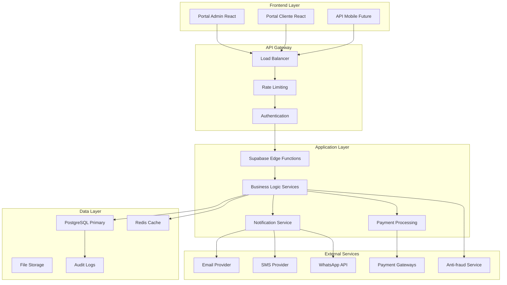
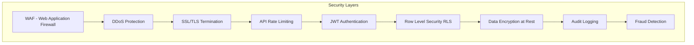

# Documento de Design

## Visão Geral

O Sistema SaaS de Cartão de Crédito é uma plataforma multi-tenant que permite que lojistas emitam e gerenciem cartões de crédito para seus clientes. O sistema é construído com uma arquitetura moderna, escalável e segura, utilizando React/TypeScript no frontend, Supabase como backend-as-a-service, e implementando as melhores práticas de segurança financeira.

### Arquitetura Atual vs. Arquitetura Proposta

**Arquitetura Atual:**
- Frontend: React + TypeScript + Vite
- Backend: Supabase (PostgreSQL + Auth + RLS)
- Estilo: Tailwind CSS
- Gráficos: ECharts
- Roteamento: React Router

**Melhorias Propostas:**
- Implementação de cache Redis
- Sistema de filas para processamento assíncrono
- Microserviços para funcionalidades críticas
- CDN para assets estáticos
- Monitoramento e observabilidade

## Arquitetura

### Arquitetura de Alto Nível



### Arquitetura de Segurança



## Componentes e Interfaces

### 1. Camada de Apresentação

#### Portal Administrativo (Lojistas)
- **Dashboard Principal**: Métricas em tempo real, gráficos interativos
- **Gestão de Clientes**: CRUD completo com histórico e analytics
- **Gestão de Cartões**: Emissão, bloqueio, configuração de limites
- **Transações**: Monitoramento em tempo real, filtros avançados
- **Faturas**: Geração automática, gestão de vencimentos
- **Cobrança**: Automação multicanal, escalação inteligente
- **Relatórios**: Dashboards customizáveis, exportação de dados
- **Configurações**: Personalização de regras de negócio

#### Portal do Cliente
- **Dashboard Pessoal**: Resumo financeiro, limite disponível
- **Histórico de Transações**: Filtros, categorização, exportação
- **Faturas**: Visualização detalhada, opções de pagamento
- **Pagamentos**: PIX, boleto, cartão de débito
- **Suporte**: Chat, tickets, FAQ

### 2. Camada de Serviços

#### Serviço de Autenticação e Autorização
```typescript
interface AuthService {
  authenticate(credentials: LoginCredentials): Promise<AuthResult>
  authorize(user: User, resource: string, action: string): Promise<boolean>
  refreshToken(token: string): Promise<string>
  logout(userId: string): Promise<void>
  enable2FA(userId: string): Promise<TwoFactorSetup>
}
```

#### Serviço de Gestão de Clientes
```typescript
interface ClientService {
  createClient(data: ClientData): Promise<Client>
  updateClient(id: string, data: Partial<ClientData>): Promise<Client>
  getClient(id: string): Promise<Client>
  listClients(filters: ClientFilters): Promise<PaginatedResult<Client>>
  calculateCreditScore(clientId: string): Promise<CreditScore>
  getClientHistory(clientId: string): Promise<ClientHistory>
}
```

#### Serviço de Cartões
```typescript
interface CardService {
  issueCard(clientId: string, config: CardConfig): Promise<Card>
  updateCardLimit(cardId: string, newLimit: number): Promise<Card>
  blockCard(cardId: string, reason: string): Promise<void>
  unblockCard(cardId: string, justification: string): Promise<void>
  getCardDetails(cardId: string): Promise<CardDetails>
  validateCardTransaction(cardId: string, amount: number): Promise<ValidationResult>
}
```

#### Serviço de Transações
```typescript
interface TransactionService {
  processTransaction(transaction: TransactionRequest): Promise<TransactionResult>
  reverseTransaction(transactionId: string, reason: string): Promise<void>
  getTransactionHistory(filters: TransactionFilters): Promise<PaginatedResult<Transaction>>
  detectFraud(transaction: TransactionRequest): Promise<FraudAnalysis>
  calculateInstallments(amount: number, installments: number): Promise<InstallmentPlan>
}
```

#### Serviço de Faturas
```typescript
interface InvoiceService {
  generateInvoice(clientId: string, period: BillingPeriod): Promise<Invoice>
  processPayment(invoiceId: string, payment: PaymentData): Promise<PaymentResult>
  calculateInterest(invoiceId: string): Promise<InterestCalculation>
  generatePaymentSlip(invoiceId: string): Promise<PaymentSlip>
  scheduleInvoiceGeneration(config: BillingConfig): Promise<void>
}
```

### 3. Camada de Dados

#### Modelo de Dados Estendido

```sql
-- Tabela de configurações avançadas
CREATE TABLE configuracoes_avancadas (
    id uuid PRIMARY KEY DEFAULT gen_random_uuid(),
    lojista_id uuid REFERENCES auth.users(id),
    
    -- Políticas de crédito
    politica_credito JSONB,
    regras_antifraude JSONB,
    limites_transacao JSONB,
    
    -- Configurações de cobrança
    templates_email JSONB,
    templates_sms JSONB,
    templates_whatsapp JSONB,
    escalacao_cobranca JSONB,
    
    -- Integrações
    webhooks JSONB,
    api_keys JSONB,
    
    data_criacao TIMESTAMPTZ DEFAULT now(),
    data_atualizacao TIMESTAMPTZ DEFAULT now()
);

-- Tabela de score de crédito
CREATE TABLE scores_credito (
    id uuid PRIMARY KEY DEFAULT gen_random_uuid(),
    cliente_id uuid REFERENCES clientes(id),
    score INTEGER NOT NULL,
    fatores JSONB,
    data_calculo TIMESTAMPTZ DEFAULT now(),
    valido_ate TIMESTAMPTZ
);

-- Tabela de tentativas de fraude
CREATE TABLE tentativas_fraude (
    id uuid PRIMARY KEY DEFAULT gen_random_uuid(),
    transacao_id uuid REFERENCES transacoes(id),
    tipo_fraude VARCHAR(100),
    score_risco NUMERIC(5,2),
    detalhes JSONB,
    acao_tomada VARCHAR(50),
    data_deteccao TIMESTAMPTZ DEFAULT now()
);

-- Tabela de acordos de pagamento
CREATE TABLE acordos_pagamento (
    id uuid PRIMARY KEY DEFAULT gen_random_uuid(),
    cliente_id uuid REFERENCES clientes(id),
    fatura_id uuid REFERENCES faturas(id),
    valor_original NUMERIC(10,2),
    valor_acordado NUMERIC(10,2),
    desconto NUMERIC(10,2),
    parcelas INTEGER,
    status VARCHAR(20),
    data_acordo TIMESTAMPTZ DEFAULT now()
);

-- Tabela de templates de notificação
CREATE TABLE templates_notificacao (
    id uuid PRIMARY KEY DEFAULT gen_random_uuid(),
    lojista_id uuid REFERENCES auth.users(id),
    tipo VARCHAR(50),
    canal VARCHAR(20),
    assunto VARCHAR(255),
    conteudo TEXT,
    variaveis JSONB,
    ativo BOOLEAN DEFAULT true
);
```

## Tratamento de Erros

### Estratégia de Tratamento de Erros

```typescript
// Hierarquia de erros customizados
abstract class AppError extends Error {
  abstract statusCode: number;
  abstract isOperational: boolean;
}

class ValidationError extends AppError {
  statusCode = 400;
  isOperational = true;
}

class AuthenticationError extends AppError {
  statusCode = 401;
  isOperational = true;
}

class AuthorizationError extends AppError {
  statusCode = 403;
  isOperational = true;
}

class BusinessRuleError extends AppError {
  statusCode = 422;
  isOperational = true;
}

class ExternalServiceError extends AppError {
  statusCode = 503;
  isOperational = true;
}

// Middleware de tratamento de erros
const errorHandler = (error: Error, req: Request, res: Response, next: NextFunction) => {
  // Log do erro
  logger.error({
    error: error.message,
    stack: error.stack,
    url: req.url,
    method: req.method,
    userId: req.user?.id,
    timestamp: new Date().toISOString()
  });

  // Resposta baseada no tipo de erro
  if (error instanceof AppError) {
    return res.status(error.statusCode).json({
      status: 'error',
      message: error.message,
      code: error.constructor.name
    });
  }

  // Erro não tratado
  return res.status(500).json({
    status: 'error',
    message: 'Erro interno do servidor',
    code: 'INTERNAL_SERVER_ERROR'
  });
};
```

### Padrões de Retry e Circuit Breaker

```typescript
// Implementação de Circuit Breaker
class CircuitBreaker {
  private failures = 0;
  private lastFailureTime?: Date;
  private state: 'CLOSED' | 'OPEN' | 'HALF_OPEN' = 'CLOSED';

  async execute<T>(operation: () => Promise<T>): Promise<T> {
    if (this.state === 'OPEN') {
      if (this.shouldAttemptReset()) {
        this.state = 'HALF_OPEN';
      } else {
        throw new Error('Circuit breaker is OPEN');
      }
    }

    try {
      const result = await operation();
      this.onSuccess();
      return result;
    } catch (error) {
      this.onFailure();
      throw error;
    }
  }

  private onSuccess() {
    this.failures = 0;
    this.state = 'CLOSED';
  }

  private onFailure() {
    this.failures++;
    this.lastFailureTime = new Date();
    
    if (this.failures >= 5) {
      this.state = 'OPEN';
    }
  }
}
```

## Estratégia de Testes

### Pirâmide de Testes

```typescript
// Testes Unitários
describe('TransactionService', () => {
  it('should validate transaction limits', async () => {
    const service = new TransactionService();
    const result = await service.validateTransaction({
      cardId: 'card-123',
      amount: 1000,
      merchantId: 'merchant-456'
    });
    
    expect(result.isValid).toBe(true);
  });
});

// Testes de Integração
describe('Payment Flow Integration', () => {
  it('should process complete payment flow', async () => {
    // Setup
    const client = await createTestClient();
    const card = await issueTestCard(client.id);
    
    // Execute
    const transaction = await processTransaction({
      cardId: card.id,
      amount: 100,
      description: 'Test purchase'
    });
    
    // Verify
    expect(transaction.status).toBe('APPROVED');
    
    const updatedCard = await getCard(card.id);
    expect(updatedCard.availableLimit).toBe(card.limit - 100);
  });
});

// Testes End-to-End
describe('Customer Portal E2E', () => {
  it('should allow customer to view invoice and make payment', async () => {
    await page.goto('/portal/login');
    await page.fill('[data-testid=email]', 'customer@test.com');
    await page.fill('[data-testid=password]', 'password123');
    await page.click('[data-testid=login-button]');
    
    await page.click('[data-testid=invoices-menu]');
    await page.click('[data-testid=invoice-123]');
    await page.click('[data-testid=pay-button]');
    
    await expect(page.locator('[data-testid=payment-success]')).toBeVisible();
  });
});
```

### Testes de Performance

```typescript
// Teste de carga para processamento de transações
import { check } from 'k6';
import http from 'k6/http';

export let options = {
  stages: [
    { duration: '2m', target: 100 }, // Ramp up
    { duration: '5m', target: 100 }, // Stay at 100 users
    { duration: '2m', target: 200 }, // Ramp up to 200 users
    { duration: '5m', target: 200 }, // Stay at 200 users
    { duration: '2m', target: 0 },   // Ramp down
  ],
  thresholds: {
    http_req_duration: ['p(95)<500'], // 95% das requests devem ser < 500ms
    http_req_failed: ['rate<0.1'],    // Taxa de erro < 10%
  },
};

export default function() {
  const payload = JSON.stringify({
    cardId: 'test-card-123',
    amount: Math.random() * 1000,
    description: 'Load test transaction'
  });

  const response = http.post('https://api.example.com/transactions', payload, {
    headers: {
      'Content-Type': 'application/json',
      'Authorization': 'Bearer test-token'
    }
  });

  check(response, {
    'status is 200': (r) => r.status === 200,
    'response time < 500ms': (r) => r.timings.duration < 500,
  });
}
```

## Monitoramento e Observabilidade

### Métricas de Negócio

```typescript
// Métricas customizadas
const businessMetrics = {
  // Métricas financeiras
  totalTransactionVolume: new prometheus.Gauge({
    name: 'total_transaction_volume',
    help: 'Volume total de transações processadas'
  }),
  
  averageTransactionValue: new prometheus.Gauge({
    name: 'average_transaction_value',
    help: 'Valor médio das transações'
  }),
  
  defaultRate: new prometheus.Gauge({
    name: 'default_rate',
    help: 'Taxa de inadimplência'
  }),
  
  // Métricas operacionais
  transactionProcessingTime: new prometheus.Histogram({
    name: 'transaction_processing_duration_seconds',
    help: 'Tempo de processamento de transações',
    buckets: [0.1, 0.5, 1, 2, 5]
  }),
  
  fraudDetectionAccuracy: new prometheus.Gauge({
    name: 'fraud_detection_accuracy',
    help: 'Precisão do sistema de detecção de fraude'
  })
};
```

### Alertas Críticos

```yaml
# Configuração de alertas (Prometheus/AlertManager)
groups:
  - name: business_critical
    rules:
      - alert: HighDefaultRate
        expr: default_rate > 0.05
        for: 5m
        labels:
          severity: critical
        annotations:
          summary: "Taxa de inadimplência alta"
          description: "Taxa de inadimplência está em {{ $value }}%, acima do limite de 5%"
      
      - alert: TransactionProcessingDelay
        expr: histogram_quantile(0.95, transaction_processing_duration_seconds) > 2
        for: 2m
        labels:
          severity: warning
        annotations:
          summary: "Processamento de transações lento"
          description: "95% das transações estão levando mais de 2 segundos"
      
      - alert: FraudDetectionDown
        expr: up{job="fraud-detection"} == 0
        for: 1m
        labels:
          severity: critical
        annotations:
          summary: "Sistema de detecção de fraude offline"
          description: "O serviço de detecção de fraude está indisponível"
```

## Segurança

### Implementação de Segurança em Camadas

```typescript
// Middleware de segurança
const securityMiddleware = [
  helmet(), // Headers de segurança
  cors({
    origin: process.env.ALLOWED_ORIGINS?.split(','),
    credentials: true
  }),
  rateLimit({
    windowMs: 15 * 60 * 1000, // 15 minutos
    max: 100 // máximo 100 requests por IP
  }),
  // Validação de entrada
  (req: Request, res: Response, next: NextFunction) => {
    // Sanitização de dados
    req.body = sanitize(req.body);
    req.query = sanitize(req.query);
    next();
  }
];

// Criptografia de dados sensíveis
class EncryptionService {
  private readonly algorithm = 'aes-256-gcm';
  private readonly key = Buffer.from(process.env.ENCRYPTION_KEY!, 'hex');

  encrypt(text: string): EncryptedData {
    const iv = crypto.randomBytes(16);
    const cipher = crypto.createCipher(this.algorithm, this.key);
    cipher.setAAD(Buffer.from('additional-data'));
    
    let encrypted = cipher.update(text, 'utf8', 'hex');
    encrypted += cipher.final('hex');
    
    const authTag = cipher.getAuthTag();
    
    return {
      encrypted,
      iv: iv.toString('hex'),
      authTag: authTag.toString('hex')
    };
  }

  decrypt(data: EncryptedData): string {
    const decipher = crypto.createDecipher(this.algorithm, this.key);
    decipher.setAAD(Buffer.from('additional-data'));
    decipher.setAuthTag(Buffer.from(data.authTag, 'hex'));
    
    let decrypted = decipher.update(data.encrypted, 'hex', 'utf8');
    decrypted += decipher.final('utf8');
    
    return decrypted;
  }
}
```

### Auditoria e Compliance

```typescript
// Sistema de auditoria
class AuditService {
  async logAction(action: AuditAction): Promise<void> {
    const auditLog = {
      id: generateUUID(),
      timestamp: new Date().toISOString(),
      userId: action.userId,
      action: action.type,
      resource: action.resource,
      resourceId: action.resourceId,
      changes: action.changes,
      ipAddress: action.ipAddress,
      userAgent: action.userAgent,
      sessionId: action.sessionId,
      result: action.result,
      metadata: action.metadata
    };

    // Armazenar em sistema imutável
    await this.auditRepository.create(auditLog);
    
    // Enviar para sistema de compliance se necessário
    if (this.isComplianceRelevant(action)) {
      await this.complianceService.notify(auditLog);
    }
  }

  async generateComplianceReport(period: DateRange): Promise<ComplianceReport> {
    const logs = await this.auditRepository.findByPeriod(period);
    
    return {
      period,
      totalActions: logs.length,
      userActions: this.groupByUser(logs),
      sensitiveDataAccess: this.filterSensitiveAccess(logs),
      failedActions: this.filterFailedActions(logs),
      anomalies: await this.detectAnomalies(logs)
    };
  }
}
```

Este design fornece uma base sólida para implementar um sistema robusto e escalável, com foco em segurança, performance e experiência do usuário. A arquitetura proposta permite crescimento gradual e manutenção eficiente do código.